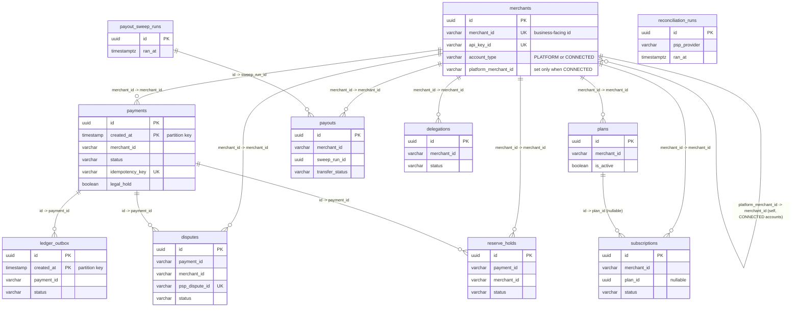

# Entity-Relationship Diagram

## No database-level foreign keys — read this before the diagram

Every relationship below is enforced in application code (a service
looks up the referenced row and 404s if it's missing), not by a
Postgres `FOREIGN KEY` constraint — grep `src/database/migrations/`
and there isn't a single `REFERENCES` in any of them. This is
consistent across every table, not an oversight on one of them, and
worth understanding rather than just noting:

- **`payments`/`ledger_outbox` are range-partitioned** (see
  [`architecture.md`](./architecture.md#partitioning)). A table that's
  the *target* of a foreign key from another table has real
  restrictions in Postgres once it's partitioned (the referenced
  column has to be part of every unique constraint on every partition,
  among other constraints) — avoiding FKs into `payments` sidesteps
  that entirely rather than working around it per-partition.
- **`merchant_id` and `payment_id` columns store the business-facing
  id as a plain string/uuid**, not a typed FK column — e.g.
  `PaymentEntity.merchantId` stores `MerchantEntity.merchantId` (the
  business-facing id used in JWT claims, rate-limit keys, etc.), *not*
  `MerchantEntity.id` (the internal uuid primary key). A real FK would
  need to target whichever column actually carries the uniqueness
  constraint being referenced — `merchant_id` columns are consistent
  about referencing the business id, not the internal PK, across every
  table below.
- **Archiving moves a `payments` row into a different schema entirely**
  (`archive.payments`) — a live FK from `disputes`/`reserve_holds` to
  `payments.id` would have to be dropped and recreated (or the
  referencing rows moved too) every time a payment crosses tiers. Since
  `disputes`/`reserve_holds` are *not* archived alongside their
  payment (a payment's disputes stay queryable in the live `disputes`
  table regardless of which schema the payment itself is in — see
  `run-archiving-job.ts`'s eligibility check, which reads `disputes`
  directly), a rigid FK relationship would actively fight this design.

Every reference is still indexed (see each table's own `@Index()`
decorators, referenced in [`schema.md`](./schema.md)) for lookup
performance — the tradeoff here is referential integrity enforcement,
not query performance.

## Diagram

`reconciliation_runs` is intentionally drawn with no edges — it
references payments only indirectly, through a `paymentId` field
*inside* its `mismatches` JSONB array, not a real column. See
[`../reconciliation.md`](../reconciliation.md) for how that gets
populated and read.

## Cold storage mirrors this shape, minus the edges that don't survive archiving

`archive.payments`/`archive.ledger_outbox` have the same columns as
their live counterparts (plus one addition, `archived_at`) but are
**not partitioned** — see
[`architecture.md`](./architecture.md#the-archive-schema). A payment's
`disputes`/`reserve_holds` rows are not copied alongside it into
`archive` — they stay in the live `disputes`/`reserve_holds` tables
regardless of which schema the payment itself currently lives in
(that's exactly why archiving's own eligibility check has to query
`disputes` directly rather than assuming "no open dispute" is somehow
implied by a payment having reached the archive tier).

## Where to find the authoritative column list

This diagram shows primary/foreign-key-shaped columns and a few
retention-relevant ones (`legal_hold`, `status`) — it is **not** a
full column reference. For the exact, current column list of any
table, read its entity file directly (see the table in
[`schema.md`](./schema.md) for the file path) — per this project's own
documentation philosophy (see
[`../../guide/api/README.md`](../../guide/api/README.md)), the code is
the source of truth and this diagram is a map, not a copy.
