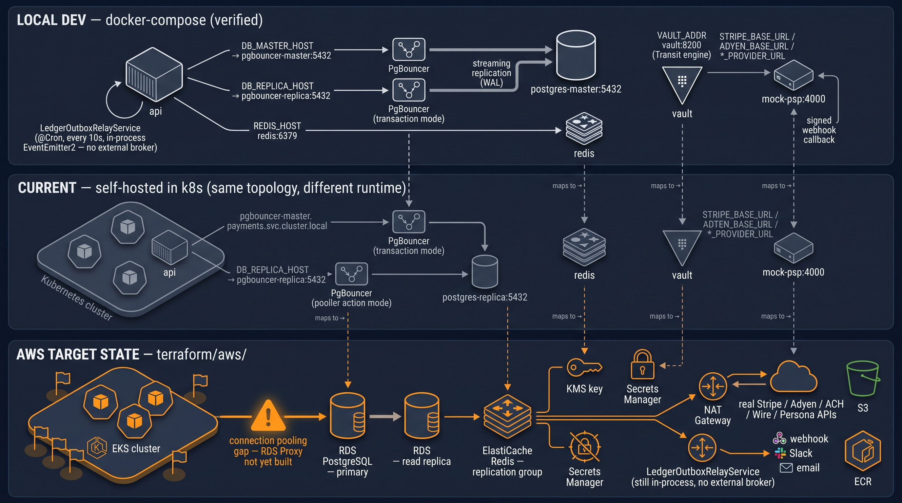
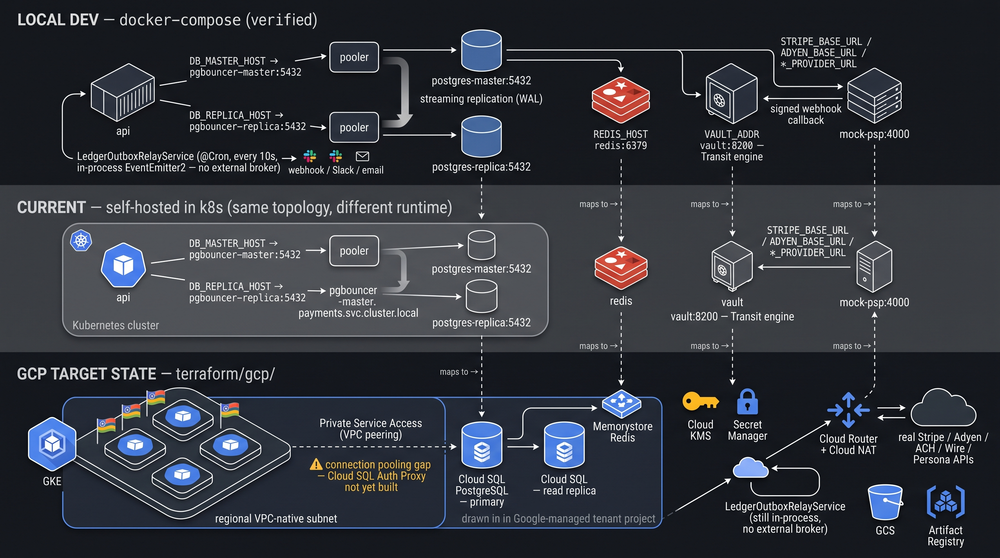

# Infrastructure as Code (Terraform)

Everything in [`../k8s/`](../k8s/) assumes a Kubernetes cluster, a
VPC/VNet, IAM, and (for a real deployment) a managed database/cache
already exist. `terraform/` at the repo root is what actually
provisions those — one independent Terraform project per cloud
(AWS/GCP/Azure), not one shared codebase parameterized by provider. See
[`../../../terraform/README.md`](../../../terraform/README.md) for the
full module-by-module breakdown; this page is the summary and the
current status, not a duplicate of that doc.

## What's in each cloud's Terraform project

Five modules, same shape across all three clouds:

| Module | AWS | GCP | Azure |
|---|---|---|---|
| `network` | VPC, per-AZ public/private subnets, NAT Gateway | one regional VPC-native subnet, Cloud NAT | Resource Group + VNet, one subnet, NAT Gateway |
| `iam` | least-privilege role + GitHub Actions OIDC federation | least-privilege roles + Workload Identity Federation | least-privilege role + Federated Identity Credential |
| `container-service` | EKS (via `terraform-aws-modules/eks`) | GKE Standard (via `terraform-google-modules/kubernetes-engine`) | AKS (via `Azure/aks/azurerm`) |
| `cloud-saas` | RDS PostgreSQL, ElastiCache Redis, S3, Secrets Manager | Cloud SQL PostgreSQL, Memorystore Redis, GCS, Secret Manager | Postgres Flexible Server, Azure Cache for Redis, Blob Storage, Key Vault |
| `hsm` | KMS key | Cloud KMS key | Premium (HSM-backed) Key Vault key |

Each cloud's modules are wired together in its own
`environments/dev/` root module. `staging/`/`production/` exist as
empty scaffolding, not yet filled in.

## Architecture diagrams

Each diagram below is the same three-tier comparison, one per cloud:
**local dev** (`docker-compose.yml`, the one tier that's actually
verified to run) → **current** (the same topology self-hosted inside
`k8s/` today) → **cloud target state** (this cloud's `terraform/`
modules). Dashed arrows connect each component to its equivalent one
tier down, and each cloud's own real connection-pooling gap (see
"Known gaps" below) is called out directly on the diagram rather than
left implicit.

These are illustrative architecture diagrams, not screenshots of a
running system — they visualize the design described in this doc and
in `terraform/`, not proof that any of it has been applied.

### AWS

### GCP

### Azure

## The boundary with `k8s/`

Terraform's scope stops at the cluster and everything below it — VPC,
IAM, the cluster itself plus cluster-wide add-ons (`metrics-server`,
VPA, Prometheus Adapter), managed database/cache/object storage, and
KMS/Key Vault. Everything *inside* the cluster that's specific to this
application (`Deployment`, `Service`, the app's own `HPA`, its
`NetworkPolicy`, its `ConfigMap`, its `CronJob`s) stays in `k8s/`,
applied via `kubectl`, never through Terraform's Kubernetes/Helm
provider — infrastructure provisioning and application deployment stay
in separate states on purpose.

## Current status: written and validated, never run

All three clouds' modules are complete, `terraform fmt`-clean, and
`terraform validate`-clean. **None of them have been run against a
real account** — no AWS/GCP/Azure credentials exist in the environment
this was authored in, so `terraform plan`/`apply` and every real
connectivity check are still outstanding. This is the same posture the
rest of this codebase already takes with the real ACH/wire bank rails
and the Persona KYC integration: the mechanism is real, it just hasn't
been proven against a live account yet. See
[`runbook.md`](./runbook.md)'s step 1 for the literal commands to run
once real credentials are available.

## Security posture: CI-gated, private control planes by default

This repo's `Security Scan` workflow (`.github/workflows/security-scan.yml`)
runs Trivy's misconfiguration scanner against everything in this repo,
including `terraform/`, and blocks merges on any CRITICAL finding. All
three clouds' Terraform currently pass that gate with zero CRITICAL
findings — verified with the exact same command the CI job runs, not
just `terraform validate`.

Two defaults worth knowing before you change them:

- **EKS's and AKS's control-plane API server default to private-only**
  (`cluster_endpoint_public_access = false` in
  `terraform/aws/modules/container-service`,
  `private_cluster_enabled = true` in
  `terraform/azure/modules/container-service`). A public control plane
  fails Trivy's AWS-0040/AZU-0041 checks regardless of IP restriction
  (AWS-0040 specifically fires on public access being enabled at all,
  not just an open CIDR) — this is the textbook-correct default, not
  just a scanner-pleasing one. **Real consequence**: `terraform apply`
  for either cluster — including the `helm_release` resources those
  modules create themselves (metrics-server, kube-prometheus-stack,
  VPA, prometheus-adapter) — can only run from something with network
  access into the VPC/VNet (a bastion, a VPN, or a self-hosted CI
  runner placed inside the network). A plain GitHub-hosted Actions
  runner cannot reach a private control plane, so the GitHub Actions
  OIDC deploy role `terraform/*/modules/iam` sets up is not, by itself,
  sufficient to run `apply` against these two modules as currently
  designed — this is a real, unresolved piece of the eventual CI/CD
  wiring, not something already solved. GCP's GKE module doesn't carry
  the equivalent finding at CRITICAL severity in Trivy's ruleset, but
  the same underlying gap (no `master_authorized_networks`/private
  endpoint configured) exists there too — it just surfaces as
  HIGH-severity in the "Full scan (report only)" step instead of
  blocking merges.
- **One CRITICAL finding is deliberately suppressed, not fixed** — see
  `.trivyignore.yaml` at the repo root. It's the EKS managed node
  group's unrestricted (`0.0.0.0/0`) outbound rule, which lives inside
  the pinned `terraform-aws-modules/eks` community module, not this
  repo's own code, and exists because worker nodes need to reach
  container registries (`registry.k8s.io`, `ghcr.io`, `quay.io`,
  `docker.io`, ...) whose IP ranges aren't fixed or enumerable —
  narrowing it would break image pulls, not improve security. The
  suppression is scoped to that exact finding ID and file path, not a
  blanket rule-wide or repo-wide disable; every other instance of the
  same underlying check (the VPC's base security group, the RDS and
  Redis security groups) is fixed for real, scoped to the VPC's own
  CIDR instead of the open internet.

## Known gaps — read before relying on this for a real deployment

- **No connection-pooling layer in front of the managed database.**
  `k8s/pgbouncer.yaml` sits between the app and Postgres today
  (transaction-mode pooling, because each pod can open up to 20
  connections and this app scales to 20 replicas). None of the three
  `cloud-saas` modules build an equivalent yet — AWS would need an RDS
  Proxy, GCP a Cloud SQL Auth Proxy sidecar, Azure could instead turn on
  Postgres Flexible Server's own built-in `pgbouncer.enabled` server
  parameter. Pointing the app straight at a managed database's raw
  endpoint at real replica-count scale will hit the same connection
  ceiling PgBouncer exists to avoid.
- **Self-hosted Postgres/Redis in `k8s/` aren't automatically replaced.**
  `k8s/postgres.yaml`, `k8s/redis.yaml`, and `k8s/pgbouncer.yaml`
  self-host these inside the cluster today, mirroring
  `docker-compose.yml`. The `cloud-saas` modules build the managed-service
  target state alongside that, not a migration — cutting over means a
  real data migration (logical replication/`pg_dump`+restore, Redis
  RDB/AOF) and repointing `DB_MASTER_HOST`/`DB_REPLICA_HOST`/`REDIS_HOST`,
  then retiring the self-hosted manifests.
- **No per-workload identity federation for the application itself
  yet.** Each cloud's `iam` module only sets up the identity Terraform/CI
  uses to run `plan`/`apply` — the application's own workload identity
  (an EKS IRSA role, a GKE Workload Identity binding, an AKS federated
  credential), scoped to its own Kubernetes ServiceAccount, is deferred
  to the `container-service` module's own cluster-issuer output and
  hasn't been wired up to a real per-workload role yet.
- **The GitHub Actions deploy role can't actually reach EKS/AKS to
  `apply` them, as currently designed.** See "Security posture" above —
  both control planes default to private-only, which a GitHub-hosted
  runner can't reach. `terraform/*/modules/iam`'s GitHub Actions OIDC
  federation covers authentication, not network reachability; a real
  CI/CD pipeline for these two modules still needs a bastion, VPN, or
  self-hosted runner inside the VPC/VNet — not yet built.
